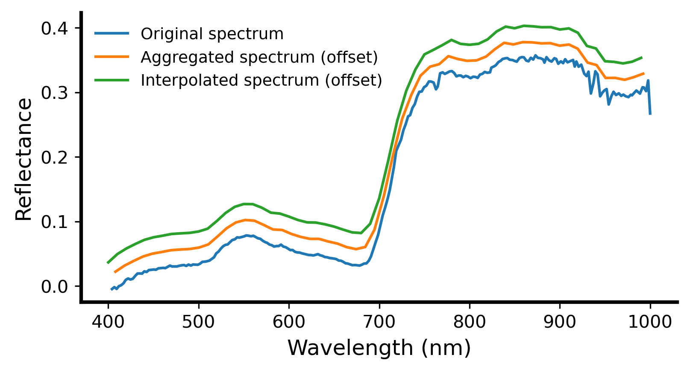

# SISTER Spectral Resample PGE Documentation

## Description

The L2A spectral resample PGE takes as input surface reflectance and uncertainty images and spectrally resamples the data
to 10nm spectral spacing. Spectral resampling is performed in a two-step process, first bands are aggregated and averaged to the closest resolution to the target resolution (10 nm). For example DESIS data, which has an average spectral spacing of 2.55 nm, is aggregated and averaged every 4 bands. Next a piecewise cubic interpolator is used to interpolate the spectra to the target wavelength spacing. Output range for all sensors except DESIS is 400-2500 nm, while the DESIS output range is 400-990 nm.

## PGE Arguments

In addition to required MAAP job submission arguments the L2A spectral resampling PGE also takes the following argument(s):

|Argument| Type |  Description | Default|
|---|---|---|---|
| l2a_granule| string |L2A ISOFIT dataset granule URL| -|

## Outputs

The L2A spectral resampling PGE exports 2 ENVI formatted datacubes along with their associated header files. The outputs of the PGE use the following naming convention:

    SISTER_INSTRUMENT_YYYYMMDDTHHMMSS_L2A_SUBPRODUCT_VERSION

|Subproduct| Description |  Units | Example filename |
|---|---|---|---|
| RSRFL| ENVI 10nm reflectance datacube | % | SISTER_AVNG\_20220502T180901\_L2A\_RSRFL_001|
| | ENVI 10nm reflectance header file  | - | SISTER_AVNG\_20220502T180901\_L2A\_RSRFL_001.hdr|
| RSUNC| ENVI 10nm uncertainty datacube | - | SISTER_AVNG\_20220502T180901\_L2A\_RSUNC_001|
| | ENVI 10nm uncertainty header file  | - | SISTER_AVNG\_20220502T180901\_L2A\_RSUNC_001.hdr|

All outputs of the PGE are compressed into a single tar.gz file using the following naming structure:

 	 	SISTER_INSTRUMENT_YYYYMMDDTHHMMSS_L2A_RSRFL_VERSION.tar.gz

for example:

		SISTER_AVNG_20220502T180901_L2A_RSRFL_001.tar.gz

## Example

	resample_job_response = maap.submitJob(
	    algo_id="sister-resample",
	    version="1.0.0",
	    l2_granule= '../AVNG_20220502T180901_L2A_RFL_001.tar.gz',
	    publish_to_cmr=False,
	    cmr_metadata={},
	    queue="sister-job_worker-32gb",
	    identifier='SISTER_AVNG_20170827T175432_L2A_RSRFL_001"
